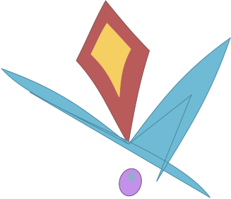

# Autodactyl
LLM-supervised learning — design and refine interactive courses featuring lessons, quizzes, exercises, and prompts, all with the help of AI.

## Overview
LLMs are powerful tools for learning, but they can sometimes feel like Wikipedia pages with personalities. Autodactyl is designed to organize the enormous educational potential of LLMs into structured, user-defined courses on any topic of their desire, replete with specialized lessons, quizzes, exercises, and projects. 

Users design a course with the LLM over as many course-building iterations as they like; once they approve a draft, they will be able to dive into their specialized course immediately. Every lesson will be generated right before their eyes, filled with the most modern and verified information available. An interactive chat will allow users to learn at their own pace, asking for clarification and depth as requested. 

An exciting projected feature is the Autodactyl Community, a hub where users can upload their specially-designed courses for other self-supervised learners to download and iterate on. The Community will bring together learners of all different backgrounds to create and collaborate on all of their favorite subjects, providing a space in which even the most independent of learners will never have to feel alone.

## Backend

- Framework: Fast API + LangChain
- Functions: Handles user requests, manages conversation histories, and interfaces from a locally-hosted LLM.
- Architecture:
  - The LLM runs in its own Docker container, isolated from the frontend.
  - Backend grants limited model access over a local port.
  - Conversations are routed and persisted via LangChain.
  - SQLite database stores course drafts and metadata for persistence after initial course development.

## Frontend
- Framework: React + Vite
- Function: Intuitive UI for building and learning courses and interacting with the broader Autodactyl Community.
- Planned Features:
  - Community tab for sharing and iterating on courses.
  - Deployment via AWS (backend) and Vercel (frontend).
